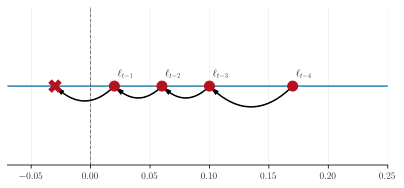
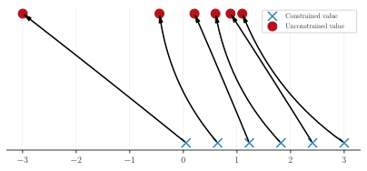

# 🔪 The sharp bits

## Pseudo-randomness

Libraries like NumPy and Scipy use *stateful* pseudorandom number generators (PRNGs).
However, the PRNG in JAX is stateless. This means that for a given function, the
return always returns the same result unless the seed is changed. This is a good thing,
but it means that we need to be careful when using JAX's PRNGs.

To examine what it means for a PRNG to be stateful, consider the following example:

```python
import numpy as np
import jax.random as jr
key = jr.key(123)

# NumPy
print('NumPy:')
print(np.random.random())
print(np.random.random())

print('\nJAX:')
print(jr.uniform(key))
print(jr.uniform(key))

print('\nSplitting key')
key, subkey = jr.split(key)
print(jr.uniform(subkey))
```
```console
NumPy:
0.5194454541172852
0.9815886617924413

JAX:
0.95821166
0.95821166

Splitting key
0.23886406
```
We can see that, in libraries like NumPy, the PRNG key's state is incremented whenever
a pseudorandom call is made. This can make debugging difficult to manage as it is not
always clear when a PRNG is being used. In JAX, the PRNG key is not incremented,
so the same key will always return the same result. This has further positive benefits
for reproducibility.

GPJax relies on JAX's PRNGs for all random number generation. Whilst we try wherever possible to handle the PRNG key's state for you, care must be taken when defining your own models and inference schemes to ensure that the PRNG key is handled correctly. The [JAX documentation](https://jax.readthedocs.io/en/latest/notebooks/Common_Gotchas_in_JAX.html#random-numbers) has an excellent section on this.

## Bijectors

Parameters such as the kernel's lengthscale or variance have their support defined on
a constrained subset of the real-line. During gradient-based optimisation, as we
approach the set's boundary, it becomes possible that we could step outside of the
set's support and introduce a numerical and mathematical error into our model. For
example, consider the lengthscale parameter $\ell$, which we know must be strictly
positive. If at $t^{\text{th}}$ iterate, our current estimate of $\ell$ was
0.02 and our derivative informed us that $\ell$ should decrease, then if our
learning rate is greater is than 0.03, we would end up with a negative variance term.
We visualise this issue below where the red cross denotes the invalid lengthscale value
that would be obtained, were we to optimise in the unconstrained parameter space.



A simple but impractical solution would be to use a tiny learning rate which would
reduce the possibility of stepping outside of the parameter's support. However, this
would be incredibly costly and does not eradicate the problem. An alternative solution
is to apply a functional mapping to the parameter that projects it from a constrained
subspace of the real-line onto the entire real-line. Here, gradient updates are
applied in the unconstrained parameter space before transforming the value back to the
original support of the parameters. Such a transformation is known as a bijection.



To help understand this, we show the effect of using a log-exp bijector in the above
figure. We have six points on the positive real line that range from 0.1 to 3 depicted
by a blue cross. We then apply the bijector by log-transforming the constrained value.
This gives us the points' unconstrained value which we depict by a red circle. It is
this value that we apply gradient updates to. When we wish to recover the constrained
value, we apply the inverse of the bijector, which is the exponential function in this
case. This gives us back the blue cross.

In GPJax, we supply bijective functions using [Numpyro](https://num.pyro.ai/en/stable/distributions.html#transforms).


## Positive-definiteness

> "Symmetric positive definiteness is one of the highest accolades to which a matrix can aspire" - Nicholas Highman, Accuracy and stability of numerical algorithms [@higham2022accuracy]

### Why is positive-definiteness important?

The Gram matrix of a kernel, a concept that we explore more in our
[kernels notebook](_examples/constructing_new_kernels.md). As such, we
have a range of tools at our disposal to make subsequent operations on the covariance
matrix faster. One of these tools is the Cholesky factorisation that uniquely decomposes
any symmetric positive-definite matrix $\mathbf{\Sigma}$ by

```math
\begin{align}
    \mathbf{\Sigma} = \mathbf{L}\mathbf{L}^{\top}\,,
\end{align}
```
where $\mathbf{L}$ is a lower triangular matrix.

We make use of this result in GPJax when solving linear systems of equations of the
form $\mathbf{A}\boldsymbol{x} = \boldsymbol{b}$. Whilst seemingly abstract at first,
such problems are frequently encountered when constructing Gaussian process models. One
such example is frequently encountered in the regression setting for learning Gaussian
process kernel hyperparameters. Here we have labels
$\boldsymbol{y} \sim \mathcal{N}(f(\boldsymbol{x}), \sigma^2\mathbf{I})$ with $f(\boldsymbol{x}) \sim \mathcal{N}(\boldsymbol{0}, \mathbf{K}_{\boldsymbol{xx}})$ arising from zero-mean
Gaussian process prior and Gram matrix $\mathbf{K}_{\boldsymbol{xx}}$ at the inputs
$\boldsymbol{x}$. Here the marginal log-likelihood comprises the following form

```math
\begin{align}
    \log p(\boldsymbol{y}) = 0.5\left(-\boldsymbol{y}^{\top}\left(\mathbf{K}_{\boldsymbol{xx}} + \sigma^2\mathbf{I} \right)^{-1}\boldsymbol{y} -\log\lvert \mathbf{K}_{\boldsymbol{xx}} + \sigma^2\mathbf{I}\rvert -n\log(2\pi)\right) ,
\end{align}
```

and the goal of inference is to maximise kernel hyperparameters (contained in the Gram
matrix $\mathbf{K}_{\boldsymbol{xx}}$) and likelihood hyperparameters (contained in the
noise covariance $\sigma^2\mathbf{I}$). Computing the marginal log-likelihood (and its
gradients), draws our attention to the term

```math
\begin{align}
    \underbrace{\left(\mathbf{K}_{\boldsymbol{xx}} + \sigma^2\mathbf{I} \right)^{-1}}_{\mathbf{A}}\boldsymbol{y},
\end{align}
```

then we can see a solution can be obtained by solving the corresponding system of
equations. By working with $\mathbf{L} = \operatorname{chol}{\mathbf{A}}$ instead of
$\mathbf{A}$, we save a significant amount of floating-point operations (flops) by
solving two triangular systems of equations (one for $\mathbf{L}$ and another for
$\mathbf{L}^{\top}$) instead of one dense system of equations. Solving two triangular systems
of equations has complexity $\mathcal{O}(n^3/6)$; a vast improvement compared to
regular solvers that have $\mathcal{O}(n^3)$ complexity in the number of datapoints
$n$.

### The Cholesky drawback

While the computational acceleration provided by using Cholesky factors instead of dense
matrices is hopefully now apparent, an awkward numerical instability _gotcha_ can arise
due to floating-point rounding errors. When we evaluate a covariance function on a set
of points that are very _close_ to one another, eigenvalues of the corresponding
Gram matrix can get very small. While not _mathematically_ less than zero, the
smallest eigenvalues can become negative-valued due to finite-precision numerical errors.
This becomes a problem when we want to compute a Cholesky
factor since this requires that the input matrix is _numerically_ positive-definite. If there are
negative eigenvalues, this violates the requirements and results in a "Cholesky failure".

To resolve this, we apply some numerical _jitter_ to the diagonals of any Gram matrix.
Typically this is very small, with $10^{-6}$ being the system default. However,
for some problems, this amount may need to be increased.

## Slow-to-evaluate

Famously, a regular Gaussian process model (as detailed in
[our regression notebook](_examples/regression.md)) will scale cubically in the number of data points.
Consequently, if you try to fit your Gaussian process model to a data set containing more
than several thousand data points, then you will likely incur a significant
computational overhead. In such cases, we recommend using Sparse Gaussian processes to
alleviate this issue.

When the data contains less than around 50000 data points, we recommend using
the collapsed evidence lower bound objective [@titsias2009] to optimise the parameters
of your sparse Gaussian process model. Such a model will scale linearly in the number of
data points and quadratically in the number of inducing points. We demonstrate its use
in [our sparse regression notebook](_examples/collapsed_vi.md).

For data sets exceeding 50000 data points, even the sparse Gaussian process outlined
above will become computationally infeasible. In such cases, we recommend using the
uncollapsed evidence lower bound objective [@hensman2013gaussian] that allows stochastic
mini-batch optimisation of the parameters of your sparse Gaussian process model. Such a
model will scale linearly in the batch size and quadratically in the number of inducing
points. We demonstrate its use in
[our sparse stochastic variational inference notebook](_examples/uncollapsed_vi.md).

## JIT compilation

There are a subset of operations in GPJax that are not JIT compatible by default. This
is because we have assertions in place to check the properties of the parameters. For
example, we check that the lengthscale parameter that a user provides is positive. This
makes for a better user experience as we can provide more informative error messages;
however, JIT compiling functions wherein these assertions are made will break the code.
As an example, consider the following code:

```python
import jax
import jax.numpy as jnp
import gpjax as gpx

x = jnp.linspace(0, 1, 10)[:, None]

def compute_gram(lengthscale):
    k = gpx.kernels.RBF(active_dims=[0], lengthscale=lengthscale, variance=jnp.array(1.0))
    return k.gram(x)

compute_gram(1.0)
```

so far so good. However, if we try to JIT compile this function, we will get an error:

```python
jit_compute_gram = jax.jit(compute_gram)
try:
    jit_compute_gram(1.0)
except Exception as e:
    print(e)
```

This error is due to the fact that the `RBF` kernel contains an assertion that checks
that the lengthscale is positive. It does not matter that the assertion is satisfied;
the very presence of the assertion will break JIT compilation.

To resolve this, we can use the `checkify` decorator to remove the assertion. This will
allow the function to be JIT compiled.

```python
from jax.experimental import checkify

jit_compute_gram = jax.jit(checkify.checkify(compute_gram))
error, value = jit_compute_gram(1.0)
```
By virtue of the `checkify.checkify`, a tuple is returned where the first element is the
output of the assertion, and the second element is the value of the function. 

This design is not perfect, and in an ideal world we would not enforce the user to wrap
their code in `checkify.checkify`. We are actively looking into cleaner ways to provide
guardrails in a less intrusive manner. However, for now, should you try to JIT compile
a component of GPJax wherein there is an assertion, you will need to wrap the function
in `checkify.checkify` as shown above.

For more on `checkify`, please see the [JAX Checkify Doc](https://docs.jax.dev/en/latest/debugging/checkify_guide.html).
